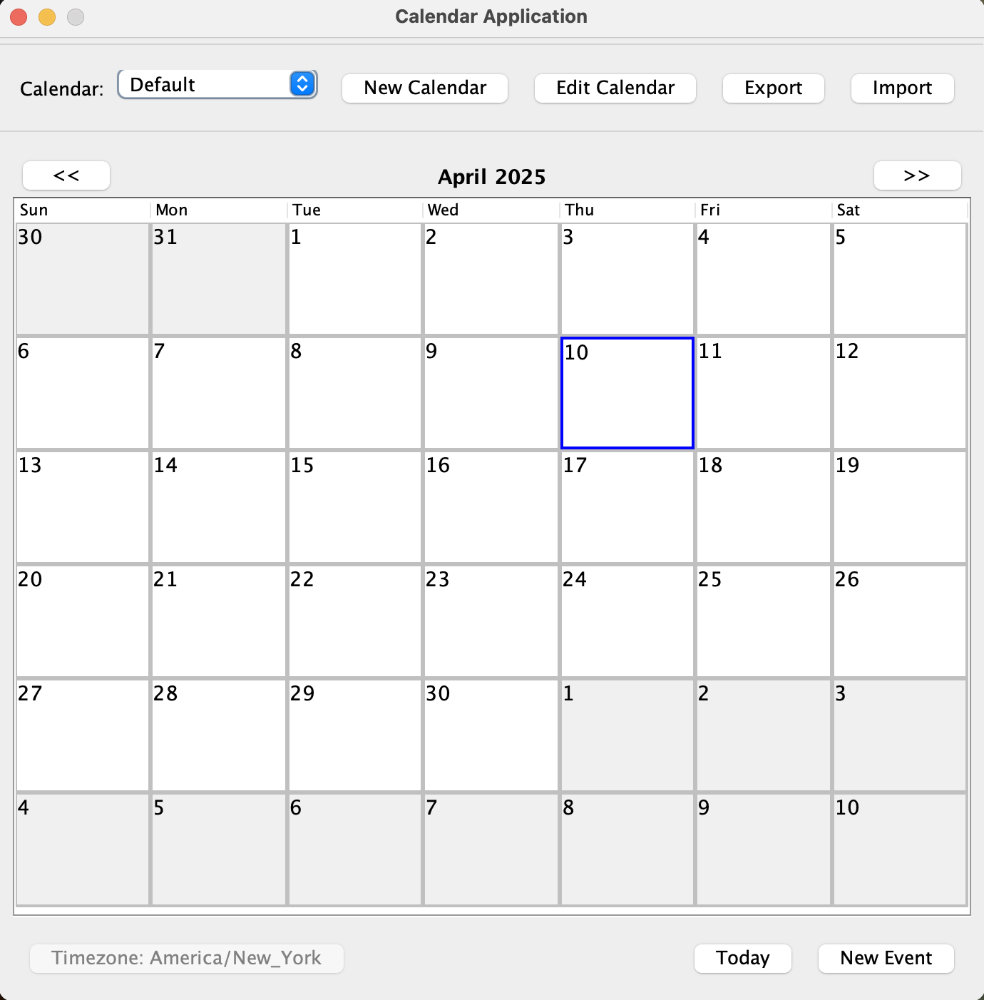

# USEME - Calendar Application

This document provides instructions on how to use the Calendar Application GUI. The application allows you to manage multiple calendars, create and edit events, and navigate through different time periods.

## Table of Contents
- [Main Window Overview](#main-window-overview)
- [Calendar Management](#calendar-management)
- [Navigation](#navigation)
- [Event Management](#event-management)
- [Day View](#day-view)

## Main Window Overview

The Calendar Application has a simple interface divided into three main sections:
- **Banner Panel** (top): Contains calendar selection dropdown and buttons for calendar operations
- **Dates Panel** (center): Displays the calendar with dates for the current month
- **Operation Buttons Panel** (bottom): Contains buttons for creating events and navigating to today and displaying the current timezone

*Main Window of the Calendar Application showing the Banner Panel, Dates Panel, and Operation Buttons Panel*

## Calendar Management

### Creating a New Calendar
1. Click the "New Calendar" button in the Banner Panel
2. Enter a name for your calendar in the "Calendar Name" field
3. Select a timezone from the "Timezone" dropdown
4. Click "Confirm" to create the calendar

*New Calendar Dialog with fields for Calendar Name and Timezone*

### Editing a Calendar
1. Select the calendar you want to edit from the "Calendar" dropdown
2. Click the "Edit Calendar" button
3. The current calendar name and timezone will be prefilled, modify the calendar name and/or timezone as desired
4. Click "Confirm" to save your changes

*New Calendar Dialog with prefilled fields for Default Calendar Name and Timezone*

### Switching Between Calendars
1. Use the "Calendar" dropdown to select from available calendars
2. The calendar view will automatically update to display the selected calendar

*Switch Calendar Dropdown with list of all the calenders present*

### Importing a Calendar
1. Click the "Import" button in the Banner Panel
2. In the file chooser dialog, navigate to and select the calendar file you want to import
3. Click "Open" to import the calendar

*Import Calendar Dialog with directory to select file*

### Exporting a Calendar
1. Select the calendar you want to export from the "Calendar" dropdown
2. Click the "Export" button in the Banner Panel
3. In the file chooser dialog, navigate to the desired location and enter a filename
4. Click "Save" to export the calendar

*Export Calendar Dialog prompting for filename and directory to save*

## Navigation

### Navigating Between Months
- Click the "<<" button to move to the previous month
- Click the ">>" button to move to the next month
- The current month and year are displayed between these buttons

### Jumping to Today
- Click the "Today" button in the Operation Buttons Panel to jump to the current month

## Event Management

### Creating a New Event
You can create a new event in two ways:

**Method 1: From the main window**
1. Click the "New Event" button in the Operation Buttons Panel
2. Fill in the event details in the dialog that appears
3. Click "Create" to save the event

**Method 2: From a specific day**
1. Click on a day in the calendar to open the Day View
2. Click the "New Event" button in the Day View dialog
3. Fill in the event details
4. Click "Create" to save the event

*Event Dialog showing fields for event details including subject, date, time, and recurrence options*

### Event Details
When creating or editing an event, you can specify:
- **Subject**: The name or title of the event
- **Location**: Where the event takes place
- **Description**: Additional details about the event
- **Start Date/Time**: When the event begins
- **End Date/Time**: When the event ends
- **All Day**: Check this box if the event lasts all day
- **Public**: Check this box if the event is public
- **Recurring**: Check this box if the event repeats

#### Recurring Event Options
If you select "Recurring", additional options appear:
1. Select which days of the week the event repeats on
2. Choose either:
   - "Repeat for" and specify a number of occurrences
   - "Repeat until" and specify an end date

## Day View

### Viewing Events for a Day
1. Click on any day in the calendar to open the Day View dialog
2. The dialog displays all events scheduled for that day

*Day View Dialog showing events for a specific day with options to create or edit events*

### Viewing Event Details
1. In the Day View dialog, double-click on an event to see its full details
2. A read-only dialog will appear showing all information about the event
3. Click "Close" to return to the Day View

### Editing an Event
1. In the Day View dialog, select an event from the list
2. Click the "Edit Event" button
3. The filds will be prefilled current details, modify the event details as needed
4. Click "Update" to save your changes

#### Editing Recurring Events
When editing a recurring event, you'll be prompted to choose from options:
- **This event only**: Changes apply only to the selected occurrence
- **This and following events with same name**: Changes apply to this and all future occurrences
- **All events with same name**: Changes apply to all occurrences of the event
